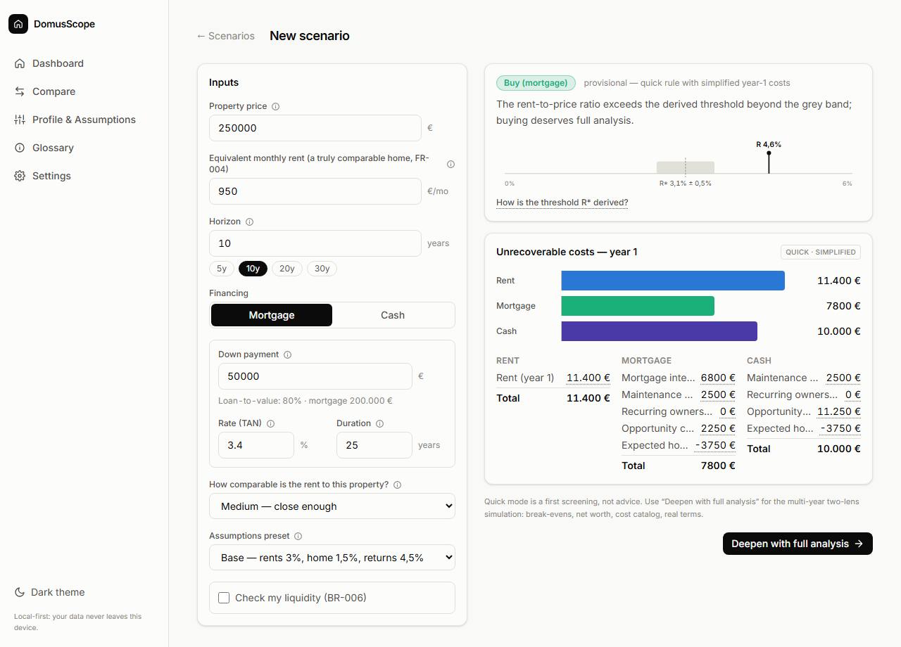
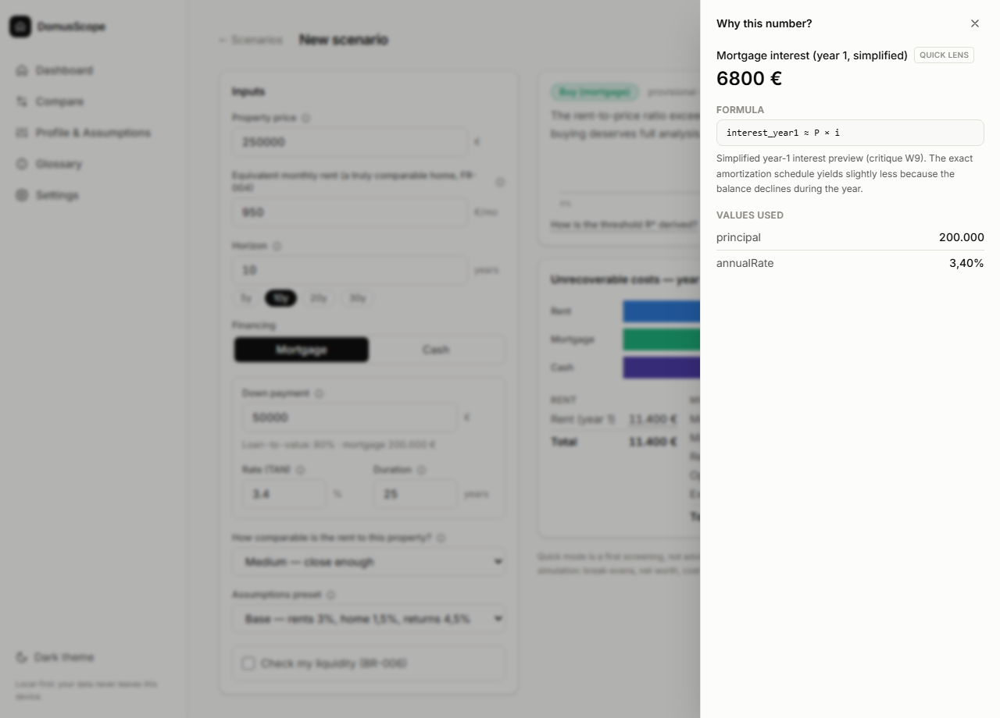
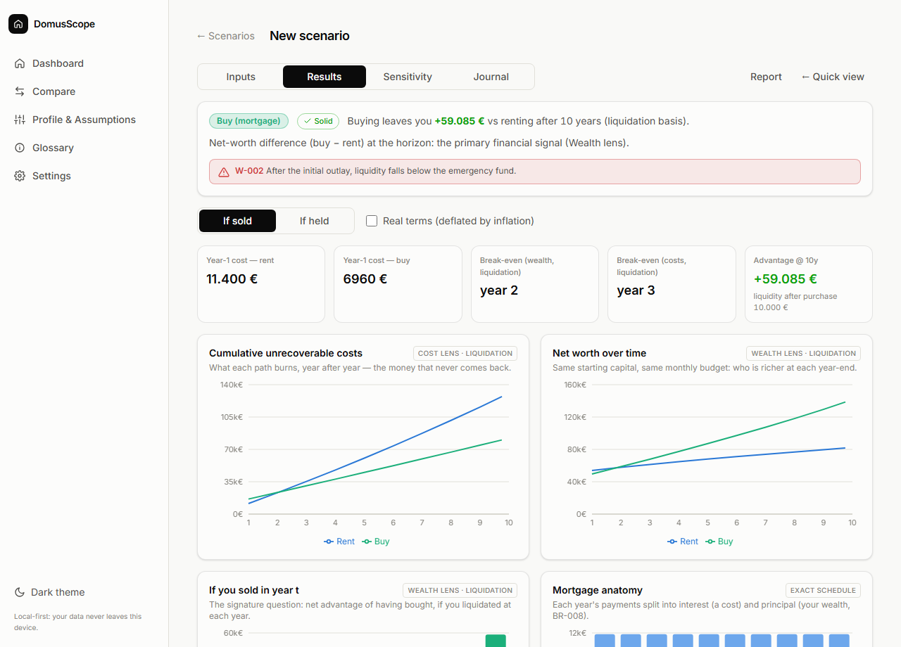
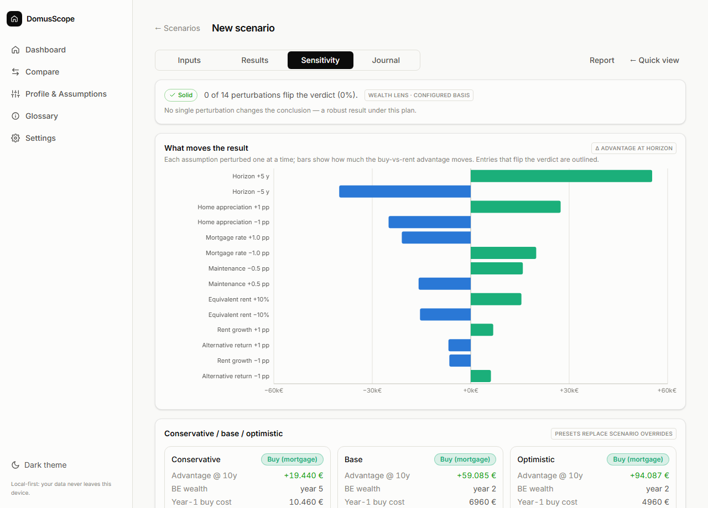

# DomusScope

[](https://github.com/riccardomerenda/domus-scope/actions/workflows/ci.yml)
[](https://github.com/riccardomerenda/domus-scope/actions/workflows/deploy.yml)
[](LICENSE)

**A local-first decision lab for the rent vs. buy vs. cash-purchase question.**

**[Try it live →](https://riccardomerenda.github.io/domus-scope/)** — no account, no
backend; everything stays in your browser.

DomusScope is a personal decision-support tool for real-estate choices. It does not answer
"is buying better than renting?" with a slogan — it simulates both paths over time,
separates _unrecoverable costs_ from _wealth accumulation_, makes every assumption
explicit and editable, and shows how fragile each conclusion is when assumptions change.

> Derived from the [source domain document](docs/00-source-document.md). This repository
> contains the critique, refined domain specification, architecture, UI design, and
> implementation roadmap — followed by the implementation itself.

## Screenshots

|                                                                                                                                       |                                                                                                             |
| :-----------------------------------------------------------------------------------------------------------------------------------: | :---------------------------------------------------------------------------------------------------------: |
| <br>_Quick mode: derived threshold R\*, year-1 costs, warnings_ |   <br>_Every number opens into its formula and inputs_   |
|      <br>_Results: net worth, break-evens, "if you sold in year t"_      | <br>_Sensitivity: tornado, verdict flips, heatmap_ |

---

## The core idea

Comparing a mortgage payment to a rent payment is the classic mistake: a mortgage payment
contains a **principal portion** (which becomes your wealth) and an **interest portion**
(which is a pure cost). The correct comparison unit is the **unrecoverable cost** of each
scenario:

| Scenario          | Main unrecoverable costs                                                |
| ----------------- | ----------------------------------------------------------------------- |
| Rent              | Rent itself, renter fees, moving costs                                  |
| Buy with mortgage | Interest, maintenance, taxes/fees, opportunity cost of invested capital |
| Buy cash          | Maintenance, taxes/fees, opportunity cost of the _entire_ price         |

DomusScope evaluates every scenario through **two complementary lenses**:

1. **Cost lens** — year-by-year unrecoverable costs, itemized and cumulated. Fast to
   understand, mirrors the "5% rule" reasoning (with the threshold _derived_ from your
   own assumptions, not hardcoded).
2. **Wealth lens** — a full cash-flow simulation where the renter invests the capital the
   buyer locks into the house. Compares total net worth over time on a liquidation basis.

## Product principles

- **Explainable** — every number can be expanded into its formula and inputs.
- **Neutral** — no ideological bias toward buying or renting; the model only reports.
- **Extremely configurable** — every economic parameter (rates, growth, maintenance,
  thresholds, cost items, presets) is data, validated by schema, never hardcoded truth.
- **Local-first & private** — financial data never leaves the device. No backend, no
  telemetry. Storage in the browser (IndexedDB) with JSON export/import.
- **Deterministic** — same inputs, same outputs, always. Rounding policy is explicit.
- **Separation of concerns** — the financial verdict is kept strictly separate from
  personal qualitative factors (stability, flexibility, family, work).

## Technology

| Layer         | Choice                                | Why                                                      |
| ------------- | ------------------------------------- | -------------------------------------------------------- |
| Language      | TypeScript (strict)                   | One language across engine and UI, strong domain typing  |
| Domain engine | Pure TS package, zero UI deps         | Deterministic, portable, exhaustively testable           |
| UI            | React 19 + Vite                       | Mature ecosystem for forms, charts, components           |
| Styling       | Tailwind CSS v4 + Radix UI primitives | Modern, accessible, fast to build a polished UI          |
| Charts        | Recharts                              | Declarative, fits the required chart set                 |
| State         | Dexie live queries + React state      | Stored data is the single source of truth                |
| Persistence   | IndexedDB via Dexie                   | Local-first, schema-versioned, migratable                |
| Validation    | Zod                                   | Schemas double as domain validation and config contracts |
| Testing       | Vitest + fast-check + Testing Library | Golden tests, property-based invariants                  |
| Tooling       | pnpm workspaces, ESLint, Prettier     | Monorepo hygiene                                         |

Full rationale and rejected alternatives: [`docs/03-architecture.md`](docs/03-architecture.md).

## Repository layout

```
domus-scope/
├── packages/
│   └── engine/          # Pure domain engine: schemas, mortgage math, simulation,
│                        # rules, sensitivity, explanation traces, presets
├── apps/
│   └── web/             # React SPA (PWA): scenario workspace, results, sensitivity,
│                        # negotiation, comparison, decision journal, settings
└── docs/                # Source document, planning set, testing guide
```

## Documentation

| Document                                                     | Content                                                                                                              |
| ------------------------------------------------------------ | -------------------------------------------------------------------------------------------------------------------- |
| [`docs/00-source-document.md`](docs/00-source-document.md)   | The original domain document the project was built from (translated from Italian)                                    |
| [`docs/01-critique.md`](docs/01-critique.md)                 | Critical review of the source domain document: validated strengths, weaknesses, gaps                                 |
| [`docs/02-domain-spec.md`](docs/02-domain-spec.md)           | Refined domain specification: methodology, corrected formulas, input/output catalogs, validation rules, test vectors |
| [`docs/03-architecture.md`](docs/03-architecture.md)         | Stack decision, monorepo layout, engine design, configuration system, persistence, testing strategy                  |
| [`docs/04-ui-design.md`](docs/04-ui-design.md)               | Information architecture, screens, design language, chart set, component inventory                                   |
| [`docs/05-roadmap.md`](docs/05-roadmap.md)                   | Phased implementation plan with milestones, tasks, and acceptance criteria                                           |
| [`docs/06-testing-guide.md`](docs/06-testing-guide.md)       | Hands-on guide: setup in three commands + a guided tour of every feature                                             |
| [`docs/07-negotiation-lens.md`](docs/07-negotiation-lens.md) | Negotiation lens (Phase 8): reservation price, ZOPA view, concessions, offer log                                     |
| [`docs/08-variable-rate.md`](docs/08-variable-rate.md)       | Variable-rate paths & partial early repayments (Phase 10): model, conventions, W-011                                 |

## Status

**All six roadmap phases complete, plus a localization & guidance pass (Phase 7), a
negotiation lens (Phase 8), a reliability pass (Phase 9), and variable-rate mortgages
with partial early repayments (Phase 10).**
The blueprint question of the source document (§21)
— _"given this house, this rent, this mortgage and my liquidity, when does buying beat
renting, and how fragile is that conclusion?"_ — is answerable end-to-end, printable,
and remembered:

- **Engine** (Phases 0–2): derived-threshold quick rule, two-lens simulation (itemized
  unrecoverable costs + budget-symmetric net-worth), Italian cost catalog, layered
  assumptions with provenance, warnings W-001…W-011, `runSensitivity()` with fragility
  index and verdict heatmap. Golden vectors from the source transcript pass byte-exactly;
  property-based tests guard the amortization and simulation invariants.
- **App** (Phases 3–5): Quick mode with live gauge and explanation drawer, full
  analytical workspace (sectioned inputs, cost-catalog editor, results with five
  CVD-validated charts and traceable year table, sensitivity tab), Compare view,
  Profile & Assumptions with presets.
- **Phase 6**: the **decision journal** (notes, visits, pros/cons, qualitative scores ×
  personal weights → a preference index shown beside — never summed with — the euros),
  the **decision record** that freezes the inputs it was based on, **snapshot history
  with input diffs** ("why did the result change?"), the **print report** with
  disclaimer and single-scenario JSON export, and **PWA** packaging (installable,
  offline-capable). Storage schema v3 with cascading deletes; v1/v2 exports still
  import.
- **Phase 7**: **bilingual UI (English / Italiano)** on a typed, dependency-free
  dictionary — a missing translation is a compile error — with a language switcher in
  Settings (Auto / English / Italiano); **field-level help**: every input carries a ⓘ
  popover explaining what it is, why it matters, typical Italian values, common
  pitfalls, and the _direction_ of its effect on the verdict; and a **Glossary** page
  (`/help`) collecting the same topics. Numbers and dates stay it-IT in both
  languages by design (spec G12).
- **Phase 8**: the **negotiation lens**
  ([spec](docs/07-negotiation-lens.md)). The engine separates **market value**
  from **transaction price**, then derives your **reservation price** — the
  walk-away boundary where buying stops beating renting-and-investing — with a
  grey band and a stressed range (never a false point estimate). The **ZOPA
  view** places it against the asking price and the typical negotiated discount
  (Banca d'Italia average, editable), warning (W-010) when the discount you
  need is atypical. A **concession converter** prices non-price variables
  (early possession, furniture, remediation) so trades become arithmetic, and
  the journal gains an **offer log** where every offered price is re-evaluated
  by the engine.
- **Phase 9**: reliability pass — error boundary with a data-export escape hatch,
  persistent-storage request with status in Settings, 404 route, mobile-nav and
  `<html lang>` accessibility fixes.
- **Phase 10**: **variable-rate mortgages & partial early repayments**
  ([spec](docs/08-variable-rate.md)). The rate becomes an explicit, editable
  **path of step changes** (e.g. Euribor stress scenarios): each step
  re-amortizes the remaining balance over the remaining contractual months,
  and W-011 warns when the path produces a **payment shock**. **Estinzioni
  anticipate parziali** inject extra principal in a chosen year — lowering the
  payment or shortening the duration — and flow through both lenses as real
  cash flows. Sensitivity shifts the whole path, not just the initial rate.

151 unit/component tests green plus a **Playwright smoke** that drives the whole journey
in a real browser (create → verdict → full analysis → negotiation → decision → reload →
remembered): `pnpm --filter @domus-scope/web e2e`.

Run it: `pnpm --filter @domus-scope/web dev` → http://localhost:5173

## Getting started

**Just want to try the app?** Follow the
[**testing guide**](docs/06-testing-guide.md) — setup in three commands plus a guided
tour of every feature.

### Prerequisites

- **Node.js ≥ 22** (24.x works) — https://nodejs.org
- **pnpm ≥ 9** — if you don't have it: `npm install -g pnpm` (or `corepack enable pnpm`
  in an elevated shell on Windows)

### Run the app

```bash
pnpm install                          # once
pnpm --filter @domus-scope/web dev    # dev server → http://localhost:5173
```

Production build + preview (what the PWA ships):

```bash
pnpm --filter @domus-scope/web build
pnpm --filter @domus-scope/web preview   # → http://localhost:4173
```

All data stays in the browser's IndexedDB on your machine — there is no server.

### Development commands

| Command                              | What it does                                                                  |
| ------------------------------------ | ----------------------------------------------------------------------------- |
| `pnpm check`                         | The full gate: typecheck + lint + all unit/component tests                    |
| `pnpm test`                          | Engine + web test suites (golden, property-based, components)                 |
| `pnpm --filter @domus-scope/web e2e` | Playwright smoke in a real browser (needs `playwright install chromium` once) |
| `pnpm typecheck` / `pnpm lint`       | TypeScript strict check / ESLint (type-checked rules)                         |
| `pnpm format`                        | Prettier over the whole repo                                                  |

To work on a single package: `pnpm --filter @domus-scope/engine test` (add watch mode
via `pnpm --filter @domus-scope/engine exec vitest`).

### Using the engine as a library

```ts
import { quickAssess, quickInputSchema, defaultEngineConfig } from "@domus-scope/engine";

const input = quickInputSchema.parse({
  propertyPrice: 200_000,
  equivalentMonthlyRent: 1_250,
  horizonYears: 10,
  financing: { kind: "mortgage", downPayment: 40_000, annualRate: 0.03, durationYears: 25 },
});

const result = quickAssess(input, defaultEngineConfig);
console.log(result.rule.threshold); // derived R*, e.g. 0.028 with default assumptions
console.log(result.verdict.kind); // "BUY_MORTGAGE" | "BUY_CASH" | "RENT" | "GREY_ZONE"
console.log(result.yearOne.mortgage?.items); // traced year-1 cost lines
```

## Disclaimer

DomusScope is a personal analysis tool. It is **not** financial, tax, notarial, or
investment advice. All defaults are editable assumptions, not predictions.
